# Outline dan Laporan Komparatif Alfagift vs Klik Indomaret (Ulasan Google Play Store 2023–2026)

## Bagian A: Outline 12 Halaman

- **Page 1: Cover Page**
  - Brand: CaRI Sentiment ID
  - Judul Utama: Laporan Analisis Komparatif Alfagift vs Klik Indomaret
  - Subjudul: Analisis Sentimen Ulasan Google Play Store dan Kinerja Layanan Digital (Rentang Data 2023–2026)
  - Metadata: Disiapkan untuk, Sumber Data, Metodologi, Tanggal Publikasi

- **Page 2: Pendahuluan & Ringkasan KPI Retail Experience**
  - Disclaimer Metodologi: Penjelasan teknis NLP BERTopic, IndoBERT Embeddings, dan Cosine Centroid dengan rentang data 15 Juni 2023 hingga 14 Juni 2026.
  - Tujuan Laporan: Tujuan analisis komparatif performa ritel dan teknis kedua aplikasi secara objektif.
  - Tabel KPI Retail Experience: Perbandingan total ulasan, rata-rata rating, dan persentase sentimen (positif, netral, negatif).
  - Paragraf Analisis Rating & Sentimen Umum: Deskripsi perbedaan volume ulasan dan kepuasan umum pengguna.

- **Page 3: Tren Sentimen & Rating**
  - Judul Section: 1. Retail experience: tren sentimen & rating
  - Deskripsi Grafik: Pengantar deskriptif 2-3 kalimat mengenai tren tahunan masing-masing aplikasi.
  - Penempatan Visual: Chart 1 (Sentiment Comparison) dan Chart 2 (Rating Trend) ditumpuk vertikal.

- **Page 4: Masalah Utama (Ulasan Negatif)**
  - Judul Section: 1. Retail experience: masalah utama (negatif)
  - Analisis Keluhan Negatif: Deskripsi temuan utama kategori keluhan negatif dominan untuk Alfagift (Layanan Pengiriman) dan Klik Indomaret (Performa Aplikasi).
  - Skor Terendah: Penjelasan kategori dengan rating rata-rata terendah dari ulasan pengguna masing-masing.
  - Penempatan Visual: Chart 3 (Top Negative Categories) diletakkan di tengah halaman.

- **Page 5: Kekuatan Utama (Ulasan Positif)**
  - Judul Section: 1. Retail experience: kekuatan utama (positif)
  - Analisis Pujian Positif: Deskripsi faktor pendukung kepuasan pelanggan utama per aplikasi berbasis data volume ulasan positif.
  - Penempatan Visual: Chart 4 (Top Positive Categories) diletakkan di tengah halaman.

- **Page 6: Analisis Promo, Harga, dan Value**
  - Judul Section: 1. Retail experience: promo, harga & value
  - Deskripsi Pola Promo & Harga: Perbandingan tanggapan pengguna terhadap efektivitas promo, gratis ongkir, harga produk, dan kesesuaian harga fisik vs aplikasi.
  - Penempatan Visual: Chart 5 (Promo & Value) diletakkan di tengah halaman.

- **Page 7: Stok Produk, Pemenuhan Pesanan, dan Loyalitas**
  - Judul Section: 1. Retail experience: stok, fulfillment & loyalty
  - Analisis Ketersediaan & Pembatalan: Pola ulasan mengenai ketidaksesuaian stok aplikasi dengan stok fisik toko dan pembatalan pesanan sepihak.
  - Analisis Poin & Loyalitas: Pola ulasan program poin loyalitas pengguna masing-masing ritel.
  - Penempatan Visual: Chart 6 (Stock & Loyalty) diletakkan di tengah halaman.

- **Page 8: Pengiriman & Integrasi Layanan Omnichannel**
  - Judul Section: 1. Retail experience: pengiriman & omnichannel
  - Analisis Pengiriman: Proporsi ulasan pengiriman, estimasi waktu, dan perilaku kurir.
  - Analisis Layanan Omnichannel: Perbandingan isu integrasi aplikasi dengan operasional toko fisik (perbedaan harga, stok tebus murah, dan pelayanan staf).
  - Penempatan Visual: Chart 7 (Delivery & Omnichannel) diletakkan di tengah halaman.

- **Page 9: KPI Kinerja Digital Service & Response**
  - Judul Section: 2. Digital service & response: KPI
  - Tabel KPI Digital Service & Response: Menampilkan perbandingan keluhan negatif, rasio balasan CS, median waktu tunda tanggapan, dan rasio pengalihan kanal eksternal.
  - Analisis Keluhan Teknis: Pembahasan mengenai efisiensi dan ketersediaan aplikasi dari sudut pandang engineering.
  - Konteks Rilis Pembaruan (APK): Penjelasan mengenai dampak pembaruan versi aplikasi yang memicu keluhan teknis.
  - Penempatan Visual: Chart 8 (Tech Issues) diletakkan di tengah halaman.

- **Page 10: Kinerja Respons Layanan Pelanggan (CS)**
  - Judul Section: 2. Digital service: respons CS di Play Store
  - Analisis Balasan CS: Perbandingan rasio respons (reply rate) dan median waktu tunggu tanggapan (median delay) di Google Play Store.
  - Karakteristik Saluran Pengalihan: Perbandingan pendekatan CS dalam mengalihkan keluhan pengguna ke kanal eksternal (Instagram DM vs Call Center/Email).
  - Penempatan Visual: Chart 9 (CS Performance – Reply Rate & Delay) diletakkan di tengah halaman.

- **Page 11: Distribusi Respons CS Berdasarkan Kategori & Kanal**
  - Judul Section: 2. Digital service: detil kanal & respons CS
  - Pengantar Deskriptif: Penjelasan mengenai kedalaman data distribusi balasan per kategori bisnis dan kanal redireksi eksternal.
  - Penempatan Visual: Chart 10 (CS Category Reply Rate) dan Chart 11 (CS Redirection Channels) ditumpuk vertikal.

- **Page 12: Dampak Pembaruan APK, Anomali Bulanan, & Ringkasan**
  - Judul Section: 2. Digital service: APK, anomali & ringkasan
  - Analisis Versi APK Terburuk: Identifikasi versi rilis aplikasi dengan akumulasi keluhan negatif tertinggi.
  - Pola Anomali Bulanan: Pembahasan lonjakan ulasan negatif (spike) pada periode tertentu.
  - Ringkasan Komparatif Faktual: Sintesis perbedaan pola antara kedua ritel tanpa memuat rekomendasi tindakan bisnis.
  - Penempatan Visual: Chart 12 (Spike / Anomaly Timeline) diletakkan di tengah halaman.

---

## Bagian B: Teks Lengkap per Halaman (comparative_analysis_report.md)

### [PAGE 1: COVER PAGE]

**CaRI Sentiment ID**

# LAPORAN ANALISIS KOMPARATIF ALFAGIFT VS KLIK INDOMARET

## Analisis Pengalaman Pengguna Ritel dan Efektivitas Layanan Digital Berbasis Ulasan Google Play Store (2023–2026)

**Disiapkan untuk:** Publik  
**Sumber Data:** Google Play Store Reviews (15 Juni 2023 – 14 Juni 2026)  
**Metodologi:** NLP BERTopic + IndoBERT Embeddings + Cosine Centroid  
**Tanggal Publikasi:** 15 Juni 2026

---

### [PAGE 2]

# PENGANTAR METODOLOGI & KPI UTAMA RETAIL EXPERIENCE

**Disclaimer Metodologi**  
Laporan komparatif ini disusun menggunakan data ulasan pengguna aplikasi Alfagift dan Klik Indomaret yang dipublikasikan di Google Play Store selama periode tiga tahun, terhitung sejak 15 Juni 2023 hingga 14 Juni 2026. Klasifikasi kategori ulasan dan analisis sentimen dilakukan secara otomatis menggunakan pemodelan bahasa alami (NLP) berbasis algoritma BERTopic yang dikombinasikan dengan IndoBERT Embeddings dan pencocokan Cosine Centroid untuk memastikan pengelompokan topik yang akurat. Tingkat kepercayaan klasifikasi model divalidasi guna meminimalkan margin kesalahan klasifikasi ulasan pengguna.

Laporan publik ini memanfaatkan analisis otomatis berbasis AI. Hasilnya bersifat indikatif, dapat mengandung ketidakakuratan, dan tidak menggantikan verifikasi atau penilaian profesional masing-masing pihak.

**Tujuan Laporan**  
Laporan ini bertujuan untuk memetakan secara objektif perbandingan pengalaman pengguna (retail experience) dan kinerja pelayanan digital (digital service response) dari kedua platform ritel modern tersebut. Fokus analisis diarahkan pada identifikasi pola ulasan positif, kategori keluhan negatif utama, serta respon dari masing-masing unit layanan pelanggan dalam menanggapi keluhan pengguna di Google Play Store tanpa menyertakan penilaian subjektif atau rekomendasi strategis.

**Tabel KPI Retail Experience (2023–2026)**

| Parameter Pengalaman Pengguna   |   Aplikasi Alfagift    | Aplikasi Klik Indomaret |
| :------------------------------ | :--------------------: | :---------------------: |
| **Total Volume Ulasan**         |     93.649 ulasan      |      39.993 ulasan      |
| **Rata-rata Rating (Weighted)** |     4,37 dari 5,00     |     3,37 dari 5,00      |
| **Proporsi Ulasan Positif**     | 77.713 ulasan (82,98%) | 22.757 ulasan (56,90%)  |
| **Proporsi Ulasan Netral**      |  2.092 ulasan (2,23%)  |  1.506 ulasan (3,77%)   |
| **Proporsi Ulasan Negatif**     | 13.844 ulasan (14,78%) | 15.730 ulasan (39,33%)  |

**Analisis Rating & Sentimen Umum**  
Berdasarkan data akumulasi ulasan selama periode 2023–2026, Alfagift mencatat volume ulasan yang lebih tinggi dengan indeks kepuasan pengguna yang tecermin dari rata-rata rating 4,37 serta dominasi sentimen positif mencapai 82,98%. Sebaliknya, Klik Indomaret mencatat total ulasan sebanyak 39.993 dengan rata-rata rating berada pada angka 3,37. Selisih kepuasan tersebut dipengaruhi oleh proporsi sentimen negatif pada Klik Indomaret yang mencatat angka 39,33%, lebih tinggi dibandingkan proporsi sentimen negatif Alfagift yang berada pada angka 14,78%.

---

### [PAGE 3]

# 1. Retail experience: tren sentimen & rating

Berikut adalah visualisasi perbandingan tren sentimen tahunan serta pergerakan rata-rata rating dari aplikasi Alfagift dan Klik Indomaret selama periode analisis 2023–2026. Data ini menggambarkan fluktuasi kepuasan pengguna dari tahun ke tahun yang dipengaruhi oleh kinerja operasional ritel dan kestabilan sistem aplikasi masing-masing platform.

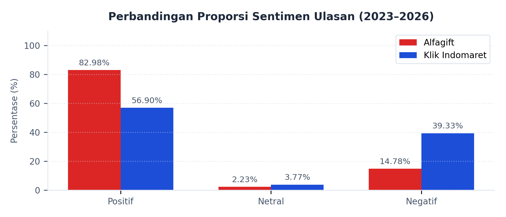

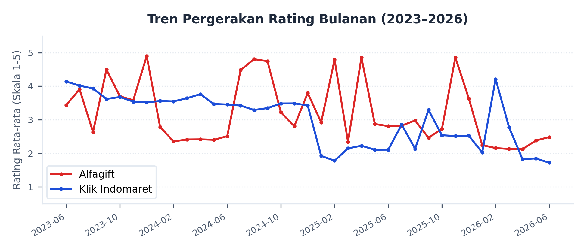

---

### [PAGE 4]

# 1. Retail experience: masalah utama (negatif)

**Analisis Keluhan Negatif Utama**  
Distribusi keluhan negatif dari pengguna kedua aplikasi menunjukkan perbedaan karakteristik masalah utama. Pada aplikasi Alfagift, kategori ulasan negatif didominasi oleh kendala operasional dengan volume keluhan tertinggi pada kategori Layanan Pengiriman (5.645 ulasan) dan Manajemen Akun (2.489 ulasan). Sementara itu, ulasan negatif pada aplikasi Klik Indomaret didominasi oleh kendala teknis sistem dengan kategori Performa Aplikasi mencatat keluhan tertinggi sebesar 6.565 ulasan, diikuti oleh kendala operasional Layanan Pengiriman dengan 4.252 ulasan. Hal ini menunjukkan bahwa kendala performa aplikasi internal merupakan faktor keluhan utama pada Klik Indomaret, sedangkan kendala layanan pengantaran fisik mendominasi keluhan pada Alfagift.

**Kategori dengan Rata-rata Rating Terendah**  
Berdasarkan penilaian ulasan per kategori, tingkat kepuasan terendah pada aplikasi Alfagift berada pada kategori Kualitas Aplikasi dan Program Promosi dan Cashback yang masing-masing mencatat rata-rata rating 1,07 dari 5,00. Pada aplikasi Klik Indomaret, kategori dengan rata-rata rating terendah diidentifikasi pada kategori Pengalaman Pengguna (UI/UX) sebesar 1,01 dari 5,00, diikuti oleh kategori Kepuasan Pelanggan secara umum yang mencatat skor rata-rata ulasan sebesar 1,03 dari 5,00.

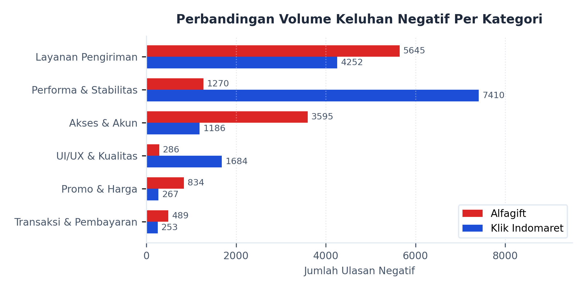

---

### [PAGE 5]

# 1. Retail experience: kekuatan utama (positif)

**Analisis Pujian Positif Utama**  
Ulasan positif yang diberikan pengguna mengindikasikan keunggulan operasional ritel yang dirasakan langsung oleh pelanggan. Pada aplikasi Alfagift, faktor pendorong kepuasan utama berada pada kategori Kepuasan Pengguna umum dengan volume mencapai 28.416 ulasan dan kategori Pengalaman Pengguna belanja online sebanyak 21.085 ulasan, di mana pengguna mencatat kemudahan transaksi belanja dari rumah. Untuk Klik Indomaret, faktor ulasan positif tertinggi juga berada pada kategori Kepuasan Pengguna (7.581 ulasan) dan Pengalaman Pengguna (6.984 ulasan), yang menunjukkan pola serupa di mana efisiensi belanja tanpa keluar rumah menjadi pendorong sentimen positif utama bagi kedua aplikasi.

**Perbandingan Faktor Pendorong Kepuasan**  
Meskipun kedua aplikasi menerima ulasan positif terkait kemudahan berbelanja online, kuantitas ulasan positif yang dikumpulkan Alfagift secara akumulatif jauh lebih besar dibandingkan Klik Indomaret. Pada Alfagift, kategori spesifik seperti Layanan Pengiriman dan Promo turut menyumbang ulasan positif masif sebesar 16.299 ulasan dengan rata-rata rating 4,99. Sebaliknya, Klik Indomaret mencatat ulasan positif terkait Promosi dan Penawaran sebesar 2.313 ulasan dan Layanan Pengiriman sebesar 1.309 ulasan dengan rata-rata rating masing-masing 4,98 dan 4,97.

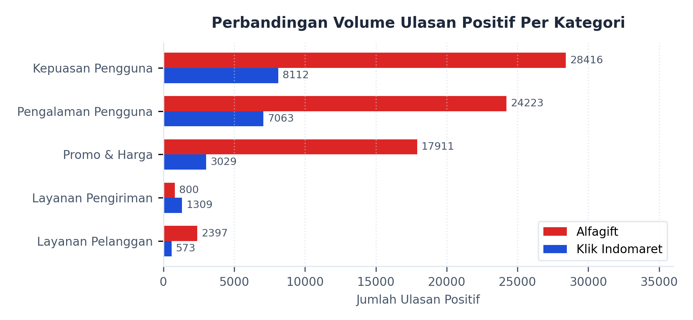

---

### [PAGE 6]

# 1. Retail experience: promo, harga & value

**Analisis Pola Ulasan Promo dan Harga**  
Penerimaan pengguna terhadap program promo dan penetapan harga menunjukkan pola yang berbeda di antara kedua aplikasi ritel. Aplikasi Alfagift mencatat kepuasan yang tinggi terkait nilai promosi melalui kategori Layanan Pengiriman dan Promo (16.299 ulasan positif) serta Harga dan Promosi (1.456 ulasan positif dengan rating rata-rata 5,00). Pengguna mengekspresikan kepuasan terhadap program gratis ongkir tanpa syarat minimal belanja yang ketat dan program potongan harga. Meskipun demikian, keluhan negatif terkait voucher atau poin yang tidak berfungsi tetap tercatat dalam porsi yang lebih kecil pada kategori Promosi dan Loyalitas (644 ulasan negatif).

Pada Klik Indomaret, aspek promo direspons positif melalui kategori Promosi dan Penawaran (2.313 ulasan positif) serta Promosi dan Diskon (521 ulasan positif). Namun, platform ini mencatat jumlah ulasan keluhan yang lebih besar terkait harga pada kategori Promosi dan Harga (267 ulasan negatif dengan rata-rata rating 1,13). Keluhan negatif tersebut didominasi oleh isu ketidaksesuaian harga produk antara katalog aplikasi dengan harga aktual di toko fisik, serta tidak munculnya fitur tebus murah promo pasca pembaruan aplikasi.

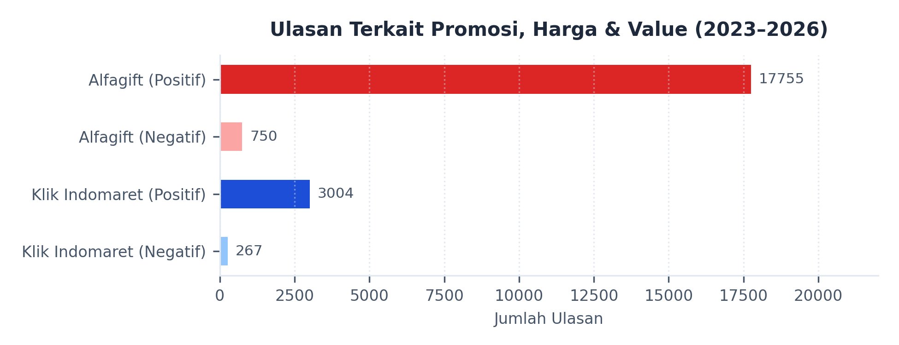

---

### [PAGE 7]

# 1. Retail experience: stok, fulfillment & loyalty

**Analisis Ketersediaan Produk & Pembatalan Pesanan**  
Keluhan terkait pemenuhan pesanan (fulfillment) tecermin dari ketidaksesuaian stok produk. Pada Alfagift, keluhan pada kategori Ketersediaan Produk tercatat sebanyak 278 ulasan negatif dengan rata-rata rating 1,16, dengan isu utama berupa stok barang kosong pada menu promosi "tebus murah" dan kosongnya persediaan air galon. Pada Klik Indomaret, keluhan terkait Manajemen Stok Produk tercatat sebanyak 123 ulasan negatif dengan rata-rata rating 1,20. Isu utama ulasan negatif Klik Indomaret berfokus pada ketidaksesuaian stok aplikasi dengan kondisi fisik di gerai penyedia, yang berujung pada tindakan pembatalan pesanan secara sepihak oleh sistem atau pihak toko tanpa adanya konfirmasi terlebih dahulu kepada pembeli.

**Analisis Program Loyalitas & Koin**  
Mekanisme reward pelanggan juga tercatat dalam ulasan pengguna. Pengguna Alfagift menyampaikan keluhan terkait program poin pada kategori Promosi dan Loyalitas (644 ulasan negatif) serta Program Loyalitas (201 ulasan negatif dengan rata-rata rating 1,14) yang mencakup kegagalan masuknya poin belanja atau kendala saat menukarkan poin dengan voucher. Di sisi lain, ulasan positif mengenai loyalitas terhadap merek (Brand Loyalty) tercatat sebanyak 84 ulasan dengan rating sempurna 5,00. Sementara itu, ulasan terkait loyalitas pada Klik Indomaret tidak terkelompok dalam kategori khusus pada ulasan teratas, melainkan menyatu dalam keluhan umum operasional saat pembaruan aplikasi yang menghilangkan riwayat belanja atau poin anggota.

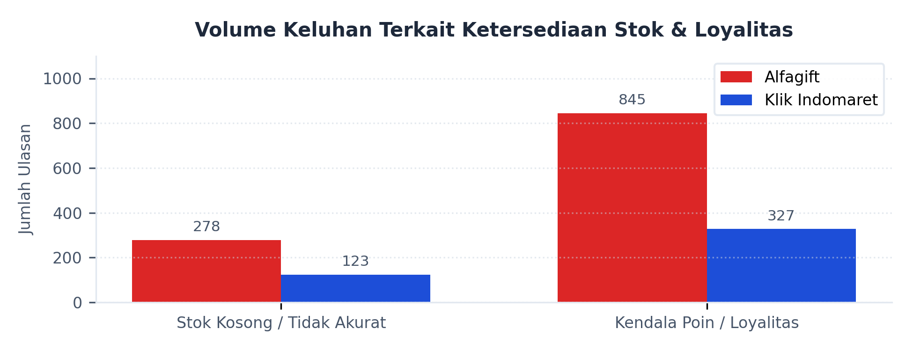

---

### [PAGE 8]

# 1. Retail experience: pengiriman & omnichannel

**Analisis Layanan Pengiriman**  
Layanan logistik merupakan titik interaksi fisik utama bagi pengguna layanan e-grocery. Kategori Layanan Pengiriman pada aplikasi Alfagift mengumpulkan 5.645 ulasan negatif (rating rata-rata 1,16) dan ulasan positif Logistik dan Pengiriman sebesar 632 ulasan (rating rata-rata 4,99). Keluhan didominasi oleh keterlambatan waktu pengantaran serta ketidakakuratan status pelacakan kurir. Pada Klik Indomaret, keluhan terkait Layanan Pengiriman mengumpulkan ulasan negatif sebanyak 4.252 ulasan (rating rata-rata 1,11) dengan keluhan utama durasi pengiriman yang melebihi estimasi waktu. Namun, Klik Indomaret juga mencatat ulasan positif terkait Layanan Pengiriman sebesar 1.309 ulasan (rating rata-rata 4,97) yang mengapresiasi keramahan kurir toko.

**Integrasi Layanan Omnichannel**  
Aspek integrasi omnichannel yang menghubungkan aplikasi digital dengan gerai fisik mencatat tantangan operasional yang serupa pada kedua merek. Isu ketidaksesuaian harga (price discrepancy) antara aplikasi dan toko fisik dilaporkan oleh pengguna Alfagift (106 ulasan negatif) dan Klik Indomaret (267 ulasan negatif). Selain itu, terdapat keluhan mengenai pelayanan staf toko fisik dan keterbatasan wilayah cakupan pengantaran (delivery coverage) dari toko terdekat (Alfagift mencatat 160 ulasan negatif terkait cakupan pengiriman; Klik Indomaret mencatat keluhan perilaku kurir/staf toko pada 21 ulasan operasional negatif).

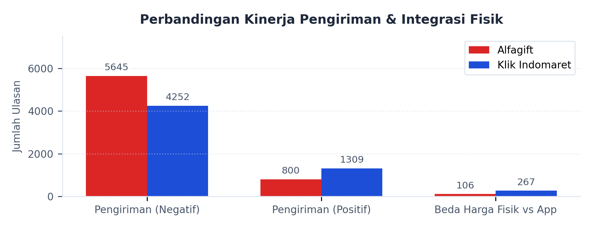

---

### [PAGE 9]

# 2. Digital service & response: KPI

**Tabel KPI Digital Service & Response (2023–2026)**

| Parameter Layanan Digital             |                            Aplikasi Alfagift                             |                       Aplikasi Klik Indomaret                       |
| :------------------------------------ | :----------------------------------------------------------------------: | :-----------------------------------------------------------------: |
| **Volume Ulasan Negatif Teranalisis** |                              13.844 ulasan                               |                            15.730 ulasan                            |
| **Rasio Balasan Admin CS**            |                          10.111 ulasan (73,04%)                          |                        6.798 ulasan (43,22%)                        |
| **Median Waktu Tunda Tanggapan**      |                                10,93 jam                                 |                              0,33 jam                               |
| **Rasio Pengalihan Kanal Eksternal**  |                        45,17% dari total balasan                         |                      95,03% dari total balasan                      |
| **Isu Teknis Utama Pengguna**         | Performa Aplikasi (1.016 ulasan) Aksesibilitas Aplikasi (709 ulasan) | Performa Aplikasi (6.565 ulasan) Kualitas Aplikasi (787 ulasan) |

Keluhan teknis memuncak setelah rilis pembaruan versi aplikasi (APK) di Google Play Store, yang sering mengganggu fungsi login, verifikasi OTP, dan integrasi metode pembayaran.

**Kategori Kendala Teknis Utama**

- **Alfagift:** Berpusat pada Performa Aplikasi (1.016 ulasan negatif; rating 1,13) dan Aksesibilitas Aplikasi (709 ulasan negatif; rating 1,18) akibat respon lambat dan kegagalan memuat katalog.
- **Klik Indomaret:** Mengalami kendala performa lebih masif pada Performa Aplikasi (6.565 ulasan negatif; rating 1,12) dan Kualitas Aplikasi (787 ulasan negatif; rating 1,06) berupa lag berat dan kegagalan sistem pembayaran.

**Isu Keamanan & Akses Aplikasi (Alfagift)**  
Berdasarkan kumpulan ulasan pengguna, pembaruan keamanan Alfagift dinilai semakin sensitif dalam mendeteksi kondisi perangkat dan memunculkan pesan kesalahan Error 70007 pada sebagian pengguna. Keluhan yang muncul menyebut bahwa perangkat dianggap ter-root atau tidak aman meskipun pengguna merasa tidak pernah melakukan root, dan beberapa di antaranya mengaitkan kejadian ini dengan penggunaan VPN, pengaktifan USB debugging, atau aplikasi utilitas tertentu. Akibat pesan kesalahan tersebut, aplikasi tidak dapat digunakan sebagaimana mestinya pada perangkat yang terdampak, sehingga pengguna kehilangan akses ke layanan Alfagift meskipun aplikasi sudah terpasang: _"Mendeteksi root, jls tidak root ponsel saya. Meski vpn tunnel sdh di force close, usb debug nonaktif"_.

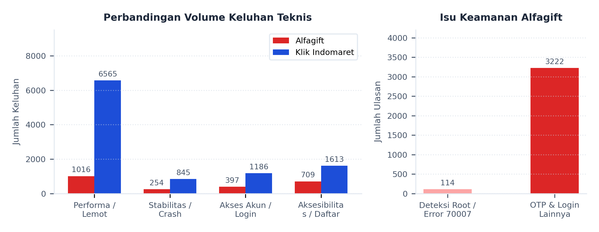

---

### [PAGE 10]

# 2. Digital service: respons CS di Play Store

**Analisis Rasio Balasan & Waktu Tunda**  
Data penanganan ulasan menunjukkan perbedaan kontras pada strategi respon layanan pelanggan (CS) dari masing-masing merek ritel. Admin CS Alfagift membalas 73,04% dari seluruh ulasan negatif yang masuk di Google Play Store (10.111 ulasan dibalas dari total 13.844 keluhan). Namun, median waktu tunda respon tercatat selama 10,93 jam. Sebaliknya, Klik Indomaret menanggapi ulasan negatif dengan rasio yang lebih rendah, yaitu hanya sebesar 43,22% (6.798 ulasan dibalas dari total 15.730 keluhan). Meskipun rasionya lebih rendah, median waktu tunda respon Klik Indomaret tercatat sangat cepat, yaitu 0,33 jam (sekitar 20 menit) setelah ulasan dipublikasikan oleh pengguna.

**Karakteristik Kanal Penanganan Eksternal & Keunggulan Alur Resolusi**  
Pola tanggapan admin CS juga berbeda dalam hal tujuan pengalihan bantuan keluhan pengguna. Admin CS Alfagift mengarahkan 45,17% ulasan negatif ke asisten virtual internal "Shalma" melalui saluran interaktif Direct Message (DM) Instagram resmi Alfagift. Sebagai keunggulan utama dalam alur resolusi, admin CS Alfagift menyertakan kode referensi tiket unik (seperti `#3896583` atau `#3896433`) langsung di setiap balasan Play Store, meminta pengguna untuk melampirkan kode tersebut saat menghubungi DM Instagram agar tim CS dapat langsung melacak riwayat dan konteks keluhan secara instan tanpa pengguna harus mengulang penjelasan masalah. Sementara itu, admin CS Klik Indomaret secara konsisten mengarahkan 95,03% dari total ulasan negatif yang dibalas menuju saluran komunikasi eksternal formal seperti Call Center telepon resmi (021-1500-280) dan surat elektronik (customercare@klikindomaret.com) secara generik tanpa disertai kode referensi pelacakan kasus.

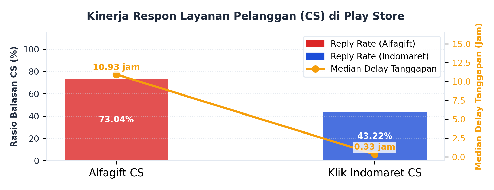

---

### [PAGE 11]

# 2. Digital service: detil kanal & respons CS

Analisis detail mengenai efektivitas respon layanan pelanggan mencakup persentase ulasan negatif yang dibalas untuk masing-masing kategori bisnis ritel serta identifikasi pola pengalihan komunikasi dari platform publik Google Play Store menuju kanal penanganan keluhan pelanggan yang bersifat privat.

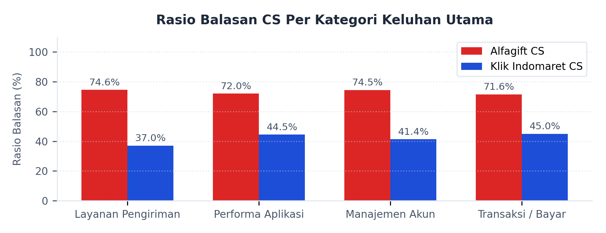

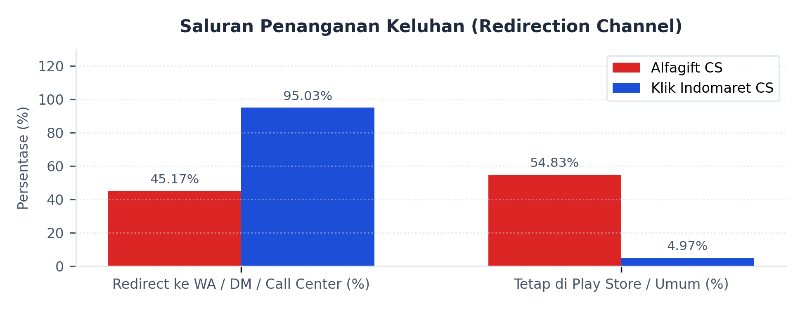

---

### [PAGE 12]

# 2. Digital service: APK, anomali & ringkasan

**Analisis Versi APK dengan Keluhan Tertinggi**  
Berdasarkan pencatatan ulasan negatif, versi aplikasi yang diluncurkan ke publik memicu konsentrasi keluhan yang berbeda. Pada Alfagift, keluhan negatif tertinggi terkonsentrasi pada versi **4.37.0** dengan 652 ulasan, diikuti versi **4.27.1** (622 ulasan), dan versi **4.47.1** (569 ulasan). Pada Klik Indomaret, konsentrasi ulasan negatif terbesar tercatat pada versi pembaruan **2512100** sebanyak 1.240 ulasan, versi **2501210** sebanyak 674 ulasan, dan versi **2501202** sebanyak 602 ulasan.

**Pola Spike / Anomali Waktu**  
Analisis lini masa menunjukkan adanya lonjakan ulasan negatif (spike) pada bulan-bulan tertentu. Ulasan negatif Alfagift mencatat lonjakan tertinggi pada **Maret 2024** (556 ulasan negatif) dan **Mei 2026** (514 ulasan negatif). Anomali temporal pada Alfagift teridentifikasi pada bulan April dan Mei yang bertepatan dengan periode pendaftaran acara tahunan "Alfamart Run" atau "Alfa Run", di mana pengguna mengeluhkan server aplikasi lumpuh (_down_) saat pembukaan pendaftaran tiket (_war tiket_) serta tiket yang langsung berstatus habis (_sold out_) dalam waktu singkat. Contoh ulasan pengguna mencatat: _"Kecewa gue sama Alfamart run.. baru kali ini war tiket ga fair banget"_ dan _"Aplikasi lemot daftar alfamart Run aja, kaga jelas sistem nya jelek"_.

Untuk Klik Indomaret, lonjakan ulasan negatif tercatat sangat ekstrem pada **Februari 2026** (2.633 ulasan negatif dari total volume ulasan bulanan sebesar 13.618), yang bertepatan dengan rilis versi aplikasi tertentu, disusul oleh lonjakan pada **Januari 2025** sebanyak 1.396 ulasan negatif. Pola kelumpuhan sistem pada Klik Indomaret terdeteksi berulang secara berkala pada periode promosi belanja online nasional (Harbolnas) atau tanggal kembar, seperti event 9.9 (9 September), 12.12 (12 Desember), dan 2.2 (2 Februari), dengan keluhan utama berupa keranjang belanja yang tidak dapat diakses, proses pembayaran gagal, dan pembatalan pesanan secara sepihak oleh sistem. Contoh ulasan pengguna mencatat: _"Saat event harbolnas selalu macet nih aplikasi"_ dan _"Balikin duit gua... udh 2x24 jam ga dibalikin.. udh batalin sepihak"_.

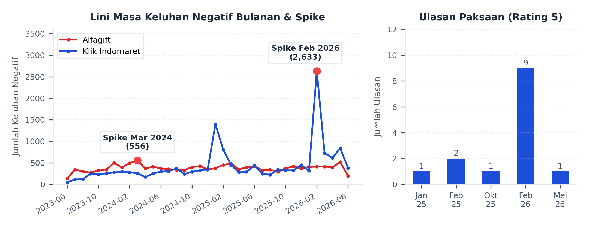

**Anomali Rating Bintang 5 Paksaan (Klik Indomaret)**  
Berdasarkan salah satu ulasan pengguna, terdapat rating bintang 5 yang isi teksnya justru berisi keluhan teknis dan menyebut adanya instruksi dari atasan agar karyawan memberikan rating tinggi. Ulasan tersebut menuliskan bahwa rating bintang 5 diberikan bukan karena kepuasan, melainkan karena tekanan internal, dan mengkritik praktik tersebut sebagai bentuk manipulasi ulasan: _"Terpaksa kasih bintang 5 karna dipaksa atasan... kalau mau rating bagus perbaiki sistem bukan manipulasi review"_.

**Ringkasan Analisis Komparatif**  
Berdasarkan data ulasan Google Play Store periode 2023–2026, Alfagift memiliki volume ulasan keseluruhan yang lebih besar serta rata-rata rating (4,37) yang lebih tinggi dibanding Klik Indomaret (3,37). Ulasan negatif Alfagift didominasi oleh isu operasional fisik (Layanan Pengiriman), dengan penanganan CS yang mencakup rasio balasan tinggi (73,04%) namun memiliki median waktu tunda respon yang lebih lama (10,93 jam). Di sisi lain, Klik Indomaret mencatat ulasan negatif yang didominasi oleh aspek teknis digital (Performa Aplikasi), dengan penanganan CS yang memiliki rasio balasan lebih rendah (43,22%) tetapi memiliki median waktu tunda respon yang sangat cepat (0,33 jam) serta didominasi oleh pengalihan keluhan menuju Call Center dan Email (95,03%).
